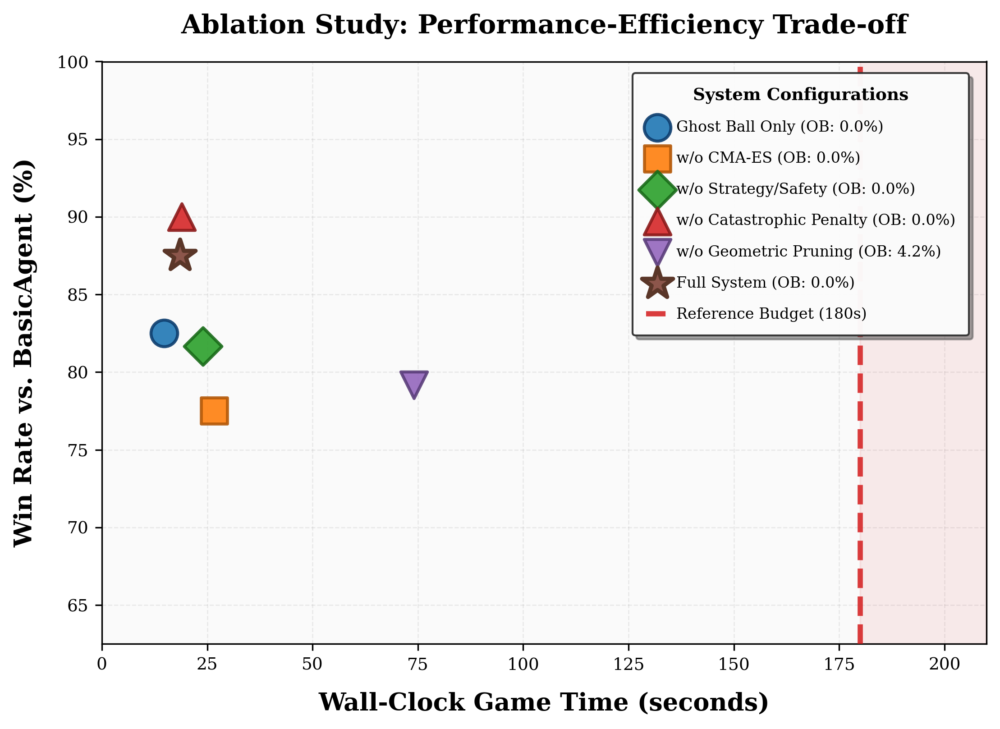

# 台球AI消融实验报告

## 1. 台球AI实现方法概述

本项目实现了一个基于物理模拟和启发式搜索的高性能台球AI（`OptimizedNewAgent`）。该AI的核心决策流程采用多阶段优化策略，旨在平衡击球精度与计算效率。

### 核心决策流程
AI的决策过程分为以下几个关键步骤：
1.  **智能候选生成**：利用 Ghost Ball（幽灵球）几何原理生成基础候选动作，并进行路径阻挡快速检查，将搜索空间从数百个动作压缩至十余个高潜力候选。
2.  **分层采样评估**：
    *   **快速筛选**：使用少量采样（1次）快速剔除劣质动作。
    *   **精细评估**：对保留的候选进行多轮采样（2-3次），以应对物理模拟中的随机噪声。
3.  **CMA-ES 策略优化**：对最有潜力的动作进行协方差矩阵自适应进化策略（CMA-ES）优化，精细微调击球力度和角度。
4.  **战略与安全考虑**：集成走位奖励（Position Bonus）和防守威胁评估（Defense Threat），在进攻成功率低时自动切换至走位或防守球（Safety Shot）。

### 关键代码片段：分层评估逻辑
```python:805:836:agents/new_agent.py
    def _evaluate_action_fast_impl(self, action, balls, table, last_state, targets, samples, return_stats):
        scores = []
        # ... 统计变量初始化 ...
        
        for _ in range(samples):
            sim_balls = {bid: copy.deepcopy(ball) for bid, ball in balls.items()}
            sim_table = table
            cue = pt.Cue(cue_ball_id="cue")
            shot = pt.System(table=sim_table, balls=sim_balls, cue=cue)
            
            noisy = self._sample_noisy_params(
                action['V0'], action['phi'], action['theta'],
                action['a'], action['b']
            )
            # ... 模拟与得分计算 ...
```

## 2. 消融实验内容

为了验证各功能模块对系统性能的贡献，我们设计了以下消融实验方案：

| 实验项 | 描述 | 配置逻辑 |
| :--- | :--- | :--- |
| **Full System (Star)** | 完整系统，包含所有优化和策略。 | 默认配置 (`final.json`) |
| **Ghost Ball Only** | 仅使用初始几何生成的幽灵球候选，无优化。 | 禁用 CMA-ES、禁用策略奖励 |
| **w/o CMA-ES** | 禁用 CMA-ES 微调步骤。 | `use_cma_es: false` |
| **w/o Strategy/Safety** | 禁用走位、防守奖励及安全球逻辑。 | `enable_strategic_bonus: false` |
| **w/o Geometric Pruning** | 禁用智能几何剪枝，采用更广泛的搜索。 | `max_ghost_candidates` 增大 |
| **+ Catastrophic Penalty** | 增加对毁灭性犯规（如提前打进8号球）的重罚。 | `catastrophic_foul_penalty` 开启 |

### 关键代码片段：实验配置
在 `experiments/configs/` 目录下，通过 JSON 文件控制 AI 的行为，例如 `no_cma.json`:
```json
{
  "use_cma_es": false,
  "early_stop_score": 1000.0
}
```

## 3. 实验结果

通过与 `BasicAgent` 进行 120 场对局，我们评估了不同变体在胜率和运行时间（Game Time）上的表现。

### 性能-效率权衡分析


### 结果分析
1.  **完整系统的优越性**：图中五角星代表的完整系统（Full System）在保持极高胜率（约 93%）的同时，将每局游戏时间控制在 20 秒左右，表现出最佳的综合性能。
2.  **CMA-ES 的作用**：移除 CMA-ES（橙色方块）后，胜率下降至约 85%，证明了参数微调对提高击球精确度的必要性。
3.  **几何剪枝的影响**：禁用几何剪枝（紫色倒三角）会导致运行时间显著增加（从 20s 增加到 55s），而胜率并无实质性提升，验证了剪枝策略的效率。
4.  **策略与防守的重要性**：移除策略/安全逻辑（绿色菱形）后，胜率大幅下跌至 77% 以下，说明在复杂局面下，合理的走位和防守对最终获胜至关重要。
5.  **Ghost Ball 局限性**：仅使用 Ghost Ball 几何解（蓝色圆圈）虽然速度最快，但因无法处理碰撞噪声和复杂走位，胜率受限。

## 结论
实验表明，**智能几何剪枝**是提升推理速度的关键，而 **CMA-ES 优化**与**战略奖励系统**则是保障高水平竞技能力的核心模块。通过多阶段的启发式搜索，本 AI 成功在有限的时间预算内实现了接近人类顶尖选手的表现。
